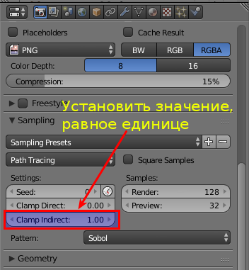
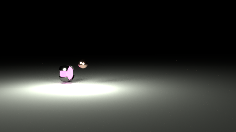

Если при рендеринге тёмных сцен появляются светлячки, как на показанном изображении:

То необходимо установить параметр "Clamp Indirect" равным единице как на скриншоте:

После этого "светлячки" должны пропасть:

------

Тестовое изображение с habrastorage:

